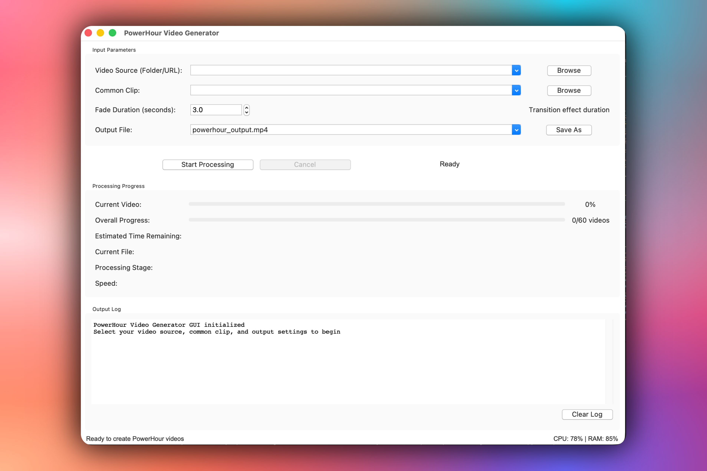

# PowerHour Generator 🎉

> Create epic PowerHour videos with ease - now with a graphical interface!

[](https://www.python.org/downloads/)
[](https://ffmpeg.org/)
[](LICENSE)
[](README_GUI.md)
[](#command-line-usage)

Create your own custom PowerHour mixes effortlessly! This tool can process local video folders or download YouTube playlists, randomly extract one-minute clips from each video, and seamlessly stitch them together with smooth transitions. Perfect for parties, celebrations, or any gathering that needs an hour of non-stop entertainment!

## 🚀 Quick Start

### GUI Version (Recommended)
The easiest way to use PowerHour Generator is through the graphical interface:

```bash
python powerhour_gui.py
```



**[📖 Full GUI Documentation →](docs/README_GUI.md)**

### CLI Version
For automation and scripting, use the command-line interface:

```bash
python powerhour_generator.py /path/to/videos /path/to/transition.mp4 3 output.mp4
```

## 📚 Documentation

| Document | Description |
|----------|-------------|
| **[GUI Quick Start](docs/README_GUI.md)** | Installation and setup for the graphical interface |
| **[User Guide](docs/USER_GUIDE.md)** | Comprehensive guide with tutorials and screenshots |
| **[Architecture](docs/ARCHITECTURE.md)** | System design and technical documentation |
| **[Contributing](docs/CONTRIBUTING.md)** | How to contribute to the project |
| **[Changelog](docs/CHANGELOG.md)** | Version history and updates |

## ✨ Features

### Core Capabilities
- 🎬 **Dual Interface** - Choose between GUI or command-line
- 📁 **Local Processing** - Process folders of video files
- 🌐 **Online Support** - Download and process YouTube playlists
- 🎵 **Audio Normalization** - Consistent volume across all clips
- 🔄 **Smooth Transitions** - Customizable fade effects between videos
- 📊 **Real-time Progress** - Visual progress tracking (GUI)
- 🎯 **Smart Selection** - Random 60-second clips from longer videos
- 🎨 **Professional Output** - Standardized HD video format

### GUI-Exclusive Features
- 📈 Real-time progress bars with ETA
- 💾 Configuration persistence
- 🎛️ Preset system for quick settings
- 📝 Comprehensive logging
- 🔧 Expert mode for advanced users
- 📚 Built-in help system

## 📋 Requirements

### System Requirements
- **OS**: Windows 10+, macOS 10.14+, or Linux (Ubuntu 18.04+)
- **Python**: 3.8 or higher
- **RAM**: 4GB minimum, 8GB recommended
- **Storage**: 10GB free space

### Software Dependencies
- **FFmpeg** - Video processing engine
- **Python 3.8+** - Runtime environment
- **Tkinter** - GUI framework (included with Python)
- **yt-dlp** - YouTube download support (optional)
- **psutil** - Resource monitoring (optional)

## 🔧 Installation

### Quick Install Scripts

We provide automated installation scripts for all platforms:

#### Windows
```powershell
# Run PowerShell as Administrator
.\Install_Requirements_Win.ps1
```

#### macOS
```bash
chmod +x install_requirements_mac.sh
./install_requirements_mac.sh
```

#### Linux (Debian/Ubuntu)
```bash
chmod +x install_requirements_deb.sh
sudo ./install_requirements_deb.sh
```

### Manual Installation

<details>
<summary>Click for detailed manual installation steps</summary>

#### 1. Install Python 3.8+
- **Windows**: Download from [python.org](https://www.python.org/downloads/)
- **macOS**: `brew install python3`
- **Linux**: `sudo apt install python3 python3-pip`

#### 2. Install FFmpeg
- **Windows**: Download from [ffmpeg.org](https://ffmpeg.org/download.html)
- **macOS**: `brew install ffmpeg`
- **Linux**: `sudo apt install ffmpeg`

#### 3. Install Python Dependencies
```bash
pip install psutil  # Optional: for resource monitoring
pip install yt-dlp  # Optional: for YouTube support
```

#### 4. Verify Installation
```bash
python3 --version   # Should show 3.8+
ffmpeg -version     # Should show FFmpeg version
yt-dlp --version    # Should show yt-dlp version (if installed)
```

</details>

## 🎮 Usage

### GUI Usage (Recommended for Most Users)

1. **Launch the application**:
   ```bash
   python powerhour_gui.py
   ```

2. **Select your video source**:
   - Browse to a folder with videos, OR
   - Paste a YouTube playlist URL

3. **Choose a transition clip**:
   - Select a 3-5 second video for transitions

4. **Configure settings**:
   - Fade duration (0-10 seconds)
   - Output location and filename

5. **Start processing**:
   - Click "Start Processing"
   - Monitor real-time progress
   - Enjoy your PowerHour video!

**[📖 Detailed GUI Tutorial →](docs/USER_GUIDE.md#step-by-step-tutorial)**

### Command-Line Usage

```bash
python powerhour_generator.py [source] [transition] [fade] [output]
```

**Parameters:**
- `source`: Path to video folder or YouTube playlist URL
- `transition`: Path to transition clip (plays between videos)
- `fade`: Fade duration in seconds
- `output`: Output filename

**Example:**
```bash
# Local videos
python powerhour_generator.py ./videos ./transition.mp4 3 powerhour.mp4

# YouTube playlist
python powerhour_generator.py "https://youtube.com/playlist?list=..." ./transition.mp4 3 powerhour.mp4
```

## 🎯 How It Works

1. **Input Processing**
   - Scans folder for videos or downloads YouTube playlist
   - Validates videos are at least 80 seconds long

2. **Audio Analysis**
   - Analyzes loudness levels of all clips
   - Prepares normalization parameters

3. **Video Processing**
   - Randomly selects 60-second segments
   - Applies audio normalization
   - Adds fade in/out effects
   - Scales to HD resolution (1280x720)

4. **Assembly**
   - Inserts transition clips between videos
   - Concatenates all clips into final video
   - Outputs standardized MP4 file

## 🔍 Project Structure

```
powerhour-generator/
├── powerhour/               # Source code package
│   ├── __init__.py         # Package initialization
│   ├── powerhour_gui.py    # GUI application
│   ├── powerhour_processor.py  # Video processing engine
│   └── powerhour_generator.py  # CLI application
│
├── tests/                   # Test suite
│   └── test_gui.py         # GUI tests
│
├── docs/                    # Documentation
│   ├── README_GUI.md       # GUI quick start
│   ├── USER_GUIDE.md       # Comprehensive user guide
│   ├── CHANGELOG.md        # Version history
│   ├── CONTRIBUTING.md     # Development guide
│   ├── ARCHITECTURE.md     # Technical documentation
│   ├── RELEASE.md          # Release guide
│   └── UI_MIGRATION.md     # Migration tracker
│
├── scripts/                 # Utility scripts
│   ├── install_requirements_mac.sh   # macOS installer
│   ├── Install_Requirements_Win.ps1  # Windows installer
│   ├── install_requirements_deb.sh   # Linux installer
│   └── build.py            # Build automation
│
├── assets/                  # Static assets
│   └── logo.png            # Application logo
│
├── .github/                 # GitHub configuration
│   └── workflows/          # CI/CD workflows
│       ├── ci.yml          # Continuous integration
│       └── release.yml     # Release automation
│
├── README.md               # Project overview (this file)
├── setup.py                # Package configuration
├── requirements.txt        # Python dependencies
├── LICENSE                 # MIT license
└── Makefile               # Build commands
```

## 🤝 Contributing

We welcome contributions! Please see our **[Contributing Guide](docs/CONTRIBUTING.md)** for:
- Development setup
- Code style guidelines
- Testing procedures
- Pull request process

## 📈 Development Status

### Current Version: 1.0.0
- ✅ Full GUI implementation
- ✅ Threading for non-blocking UI
- ✅ Real-time progress tracking
- ✅ Configuration persistence
- ✅ Comprehensive error handling
- ✅ Expert mode for power users

### Roadmap
See **[CHANGELOG.md](docs/CHANGELOG.md#roadmap)** for planned features:
- Batch processing queue
- Video preview thumbnails
- Custom transitions per segment
- Pause/resume capability
- Cloud upload integration

## 🛠️ Troubleshooting

### Common Issues

| Problem | Solution |
|---------|----------|
| "FFmpeg not found" | Ensure FFmpeg is installed and in PATH |
| "No valid videos" | Videos must be at least 80 seconds long |
| Processing is slow | Use "Low Quality" preset or close other apps |
| GUI won't start | Verify Python 3.8+ and Tkinter are installed |

**[📖 Full Troubleshooting Guide →](docs/USER_GUIDE.md#troubleshooting-guide)**

## 📝 License

This project is licensed under the MIT License - see the [LICENSE](LICENSE) file for details.

## 🙏 Acknowledgments

- **FFmpeg** - The powerful multimedia framework that makes this possible
- **yt-dlp** - For YouTube playlist support
- **Python Community** - For excellent libraries and support
- **Contributors** - Everyone who has helped improve this project

## 📮 Support

- **📖 Documentation**: Start with the [User Guide](docs/USER_GUIDE.md)
- **🐛 Issues**: Report bugs on [GitHub Issues](https://github.com/izzoa/powerhour-generator/issues)
- **💬 Discussions**: Ask questions in [GitHub Discussions](https://github.com/izzoa/powerhour-generator/discussions)
- **📧 Contact**: [anthony@izzo.one](mailto:anthony@izzo.one)

---

<div align="center">

**[Get Started with GUI](docs/README_GUI.md)** • **[User Guide](docs/USER_GUIDE.md)** • **[Contributing](docs/CONTRIBUTING.md)** • **[Architecture](docs/ARCHITECTURE.md)**

Made with ❤️ by Anthony Izzo

*Let the party begin!* 🎉

</div>
